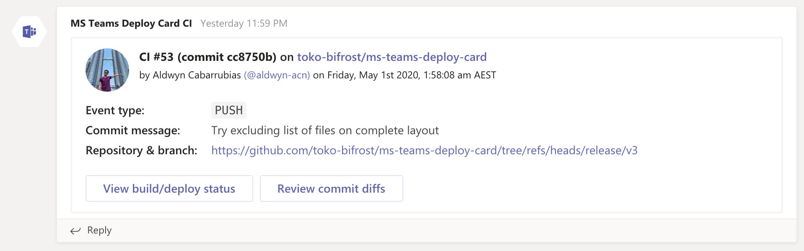

# Microsoft Teams Deploy Card


A comprehensive notification card in Microsoft Teams for your deployments.

### Layouts

#### Complete


#### Complete (without files)



#### Cozy


#### Compact


### Usage

1. Add `MS_TEAMS_WEBHOOK_URI` on your repository's configs on Settings > Secrets. It is the [webhook URI](https://docs.microsoft.com/en-us/microsoftteams/platform/webhooks-and-connectors/how-to/add-incoming-webhook) of the dedicated Microsoft Teams channel for notification.

2) Add a new `step` on your workflow code below `actions/checkout@v2`:

```yaml
name: MS Teams Deploy Card

on: [push]

jobs:
  build:
    runs-on: ubuntu-latest

    steps:
      - uses: actions/checkout@v2
      # this is the new step
      - uses: toko-bifrost/ms-teams-deploy-card@master #  or "./" if in a local set-up
        with:
          github-token: ${{ github.token }}
          webhook-uri: ${{ secrets.MS_TEAMS_WEBHOOK_URI }}
```

3. Tweak the following configurations
   - `github-token` - (required), this can be set to the following:
     - `${{ github.token }}`
     - `${{ secrets.GITHUB_TOKEN }}`
     - a manually added secret with more Github API permissions, e.g. `${{ secrets.<custom secret here> }}`
   - `webhook-uri` - (required), the value of `MS_TEAMS_WEBHOOK_URI`
   - `timezone` - (optional, defaults to `UTC`), a [valid database timezone name](https://en.wikipedia.org/wiki/List_of_tz_database_time_zones), e.g. "Australia/Sydney"
   - `layout` - (optional, defaults to `complete`), layout template (choices are `complete`, `cozy`, `compact`)
   - `include-files` - (optional, defaults to `true`), include the list of files when `layout` is set to `complete`
   - `allowed-file-len` - (optional, defaults to `7`), allowed number of changed files to display, when `include-files` is set to `true`

### Local Set-up

1. Clone this repository.
2. Install JS dependencies via `yarn install` or `npm install`.
3. Before pushing you changes, execute `yarn ncc` (or `npm run ncc`) to create a build on `dist`.
4. Do not remove the `dist` repository. Ever.
5. Check the Actions tab for the errors if there are any.

### Known Issues

- Avoid naming your secrets with the prefix `GITHUB_` as secrets are being used as environment variables, and they are reserved for Github Actions' use only. Better stick with `CI_GITHUB_TOKEN`.
- As this is still in development, always use the working latest version from the `Releases`, as they have more bug fixes and added features.
